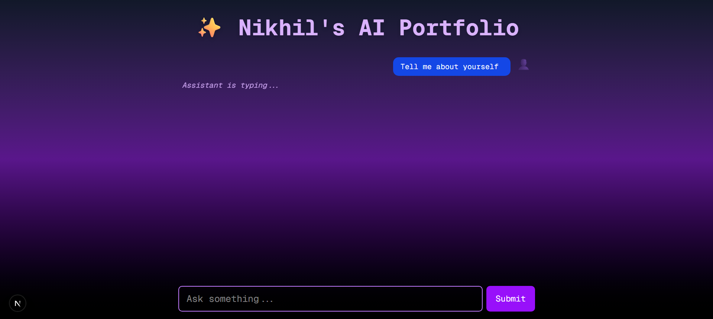

# 🤖 AI Portfolio — Nikhil Saini

An intelligent, AI-powered personal portfolio built with **Next.js**, **LangChain**, **DataStax Astra DB**, and **Hugging Face Inference API**. Ask questions and get real-time responses based on your actual projects and experience — powered by Retrieval-Augmented Generation (RAG).

---


## 🚀 Features

- 💬 AI chatbot that answers based on portfolio data
- 📚 RAG pipeline using LangChain and Astra DB vector search
- 🔍 Embedding with Hugging Face’s `all-MiniLM-L6-v2`
- 🧠 Response generation via Hugging Face LLM (`zephyr-7b-beta`, etc.)
- 💡 Fully styled with Tailwind CSS
- ⚙️ Built on Next.js App Router architecture

---

## 🛠️ Tech Stack

| Tech                     | Purpose                                 |
|--------------------------|-----------------------------------------|
| [Next.js](https://nextjs.org/)         | React-based frontend framework        |
| [LangChain](https://www.langchain.com/) | Contextual RAG and vector querying    |
| [Astra DB](https://www.datastax.com/astra)       | Vector database & document store     |
| [Hugging Face Inference API](https://huggingface.co/inference-api) | Embeddings + LLM chat completion     |
| [Tailwind CSS](https://tailwindcss.com/)         | Styling and responsive layout         |

---

## 📁 Folder Structure

```bash
ai-portfolio/
├── app/
│   ├── api/
│   │   └── chat/
│   │       └── route.js         # API handler using LangChain + HuggingFace
│   ├── layout.jsx               # Root layout
│   └── page.jsx                 # Chat UI with Tailwind styling
├── db/
│   ├── loadToDb.js              # Script to load portfolio chunks into Astra DB
|   └──sample-data.json          # Project/portfolio content to be vectorized
├── public/
│   └── ChatGPT.png              # Background image or assets                                
├── .env.                        # Environment variables (not committed)
├── package.json
├── tailwind.config.js
├── postcss.config.js
├── README.md


⚙️ Environment Setup
bash
Copy
Edit
# 1. Clone the repo
git clone https://github.com/nik-13204/ai-portfolio.git
cd ai-portfolio

# 2. Install dependencies
npm install

# 3. Add environment variables
cp .env.example .env.local
# Fill in HUGGINGFACE_API_KEY and ASTRA credentials

# 4. Vectorize and load your data
node db/loadToDb.js

# 5. Run locally
npm run dev

🔐 Example .env.local
env
Copy
Edit
HUGGINGFACE_API_KEY=your_huggingface_api_key
ASTRA_DB_APPLICATION_TOKEN=your_astra_app_token
ASTRA_DB_API_ENDPOINT=https://your-region.apps.astra.datastax.com
✨ How It Works
User sends a question via chat input

Message is embedded via HuggingFace (MiniLM)

Top 5 related document chunks are retrieved from Astra DB

These are used as context in a prompt passed to a Hugging Face LLM

AI responds based on your actual portfolio content

👨‍💻 Author
Nikhil Saini